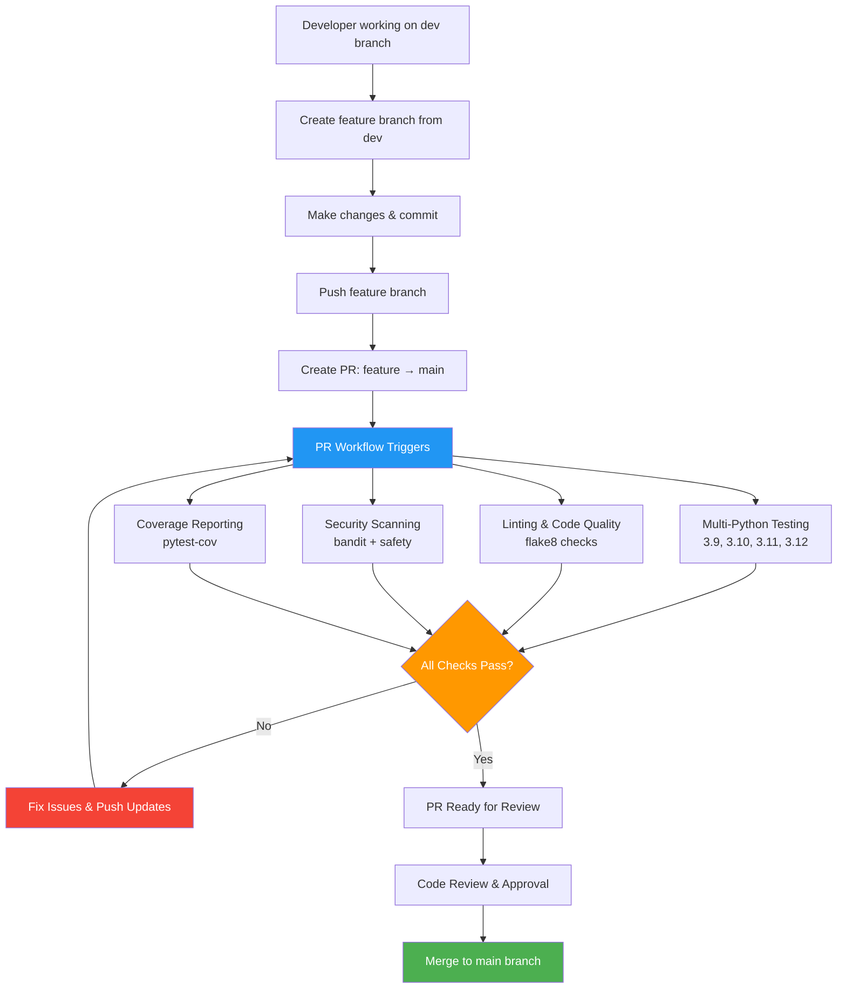
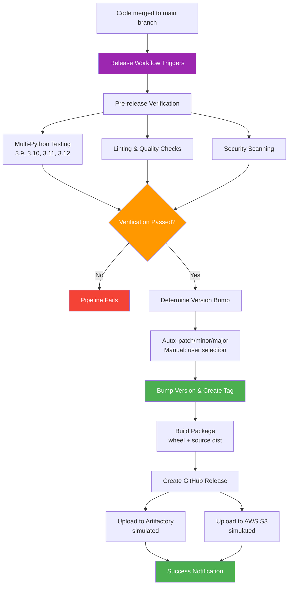

# MSD Pipeline Homework - CI/CD Implementation

A complete CI/CD pipeline implementation for a Python project using GitHub Actions, demonstrating best practices for Pull Request workflows and Release automation.

## Project Overview

This project implements a simple calculator application with a comprehensive CI/CD pipeline that supports:
- **Pull Request Workflow**: Automated testing and quality checks
- **Release Workflow**: Version bumping, tagging, building, and artifact storage

## Project Structure

```
msd-pipiline-hw/
├── .github/
│   └── workflows/
│       ├── pr.yml          # Pull Request CI workflow
│       └── release.yml     # Release automation workflow
├── main.py                 # Simple calculator application
├── test_main.py           # Unit tests for the calculator
├── setup.py               # Package configuration
├── requirements.txt       # Project dependencies
└── README.md              # This file
```

## Application Description

The project contains a simple calculator application (`main.py`) with basic mathematical operations:
- Addition
- Subtraction
- Multiplication  
- Division (with zero-division protection)

The application includes comprehensive unit tests (`test_main.py`) covering all functionality and edge cases.

## CI/CD Pipeline Implementation

### Pull Request Workflow (`.github/workflows/pr.yml`)

**Trigger**: When a Pull Request is opened, updated, or reopened against the `main` branch (typically from `dev` branch).

**Features:**
- **Multi-Python Version Testing**: Tests against Python 3.9, 3.10, 3.11, and 3.12
- **Dependency Caching**: Caches pip dependencies for faster builds
- **Code Quality Checks**: 
  - Linting with flake8
  - Syntax error detection
  - Complexity analysis
- **Testing**:
  - Unit tests with unittest
  - Coverage reporting with pytest-cov
  - Coverage upload to Codecov
- **Security Scanning**:
  - Bandit for security vulnerability detection
  - Safety for dependency vulnerability scanning
  - Security reports uploaded as artifacts

**Workflow Steps:**
1. Checkout code
2. Set up Python matrix (3.9-3.12)
3. Cache dependencies
4. Install project and dependencies
5. Run linting checks
6. Execute unit tests
7. Generate coverage reports
8. Perform security scans
9. Upload artifacts and reports

### Release Workflow (`.github/workflows/release.yml`)

**Triggers**: 
- Push to `main` branch (automatic)
- Manual dispatch with version bump selection

**Features:**
- **Automatic Version Bumping**: Uses bump2version with semantic versioning
- **Smart Version Detection**: Analyzes commit messages to determine bump type
- **Git Tagging**: Creates annotated tags for releases
- **Package Building**: Creates wheel and source distributions
- **Multi-Stage Deployment**:
  - GitHub Releases with artifacts
  - Simulated Artifactory upload
  - Simulated AWS S3 storage
- **Comprehensive Notifications**: Success/failure reporting

**Workflow Jobs:**

1. **version-and-tag**:
   - Determines version bump type (patch/minor/major)
   - Updates version in source files
   - Creates git tag
   - Pushes changes to repository

2. **build-and-release**:
   - Runs tests before building
   - Creates wheel and source distributions
   - Validates build artifacts
   - Creates GitHub release with artifacts

3. **deploy-to-artifactory**:
   - Simulates upload to Artifactory
   - Simulates upload to AWS S3
   - In production, would use actual credentials and endpoints

4. **notify**:
   - Reports pipeline success/failure
   - Provides deployment status

## Tool Selection and Rationale

### GitHub Actions
**Why chosen**: 
- Native integration with GitHub repositories
- Rich ecosystem of pre-built actions
- Matrix builds for multi-version testing
- Built-in artifact storage
- Comprehensive workflow orchestration

**Alternatives considered**: Azure DevOps (mentioned in requirements but GitHub Actions chosen for better integration)

### Testing Tools
- **unittest**: Python's built-in testing framework for reliability
- **pytest**: Advanced testing features and coverage reporting
- **flake8**: Comprehensive linting and style checking
- **bandit**: Security-focused static analysis
- **safety**: Dependency vulnerability scanning

### Version Management
- **bump2version**: Reliable semantic versioning with git integration
- **setuptools**: Standard Python packaging
- **wheel**: Modern Python distribution format

### Deployment Simulation
- **Artifactory**: Enterprise artifact repository (simulated)
- **AWS S3**: Cloud storage for packages (simulated)
- **GitHub Releases**: Built-in release management

## Manual Pipeline Execution

### Running the PR Workflow
1. Create a feature branch from dev: `git checkout dev && git checkout -b feature/my-feature`
2. Make your changes and commit
3. Push branch: `git push origin feature/my-feature`
4. Open a Pull Request against `main` (from your feature branch)
5. The PR workflow will automatically trigger

### Running the Release Workflow

**Automatic (on push to main):**
```bash
git checkout main
git pull origin main
# Make changes and commit
git push origin main
# Release workflow triggers automatically
```

**Manual (with version control):**
1. Go to Actions tab in GitHub
2. Select "Release Pipeline" workflow
3. Click "Run workflow"
4. Choose version bump type (patch/minor/major)
5. Click "Run workflow"

### Local Development and Testing

**Setup:**
```bash
# Clone repository
git clone <repository-url>
cd msd-pipiline-hw

# Install dependencies
pip install -r requirements.txt
pip install -e .
```

**Run tests locally:**
```bash
# Unit tests
python -m unittest discover -s . -p "test_*.py" -v

# With coverage
pip install pytest-cov
pytest --cov=main --cov-report=term-missing

# Linting
pip install flake8
flake8 . --max-line-length=127

# Security scan
pip install bandit safety
bandit -r .
safety check
```

**Build package locally:**
```bash
pip install build
python -m build
# Artifacts created in dist/ directory
```

## CI/CD Workflow Diagrams

### Pull Request Workflow



### Release Workflow



## Workflow Scenarios Explained

### Pull Request Scenario
**Purpose**: Ensure code quality and functionality before merging to main

**Process**:
1. Developer creates PR from feature branch to main → Workflow triggers
2. Code is tested across multiple Python versions (3.9-3.12)
3. Quality checks (linting, security) are performed
4. Coverage reports are generated
5. Reviewers can see test results before approving
6. Only passing PRs should be merged to main

**Key Benefits**:
- Prevents broken code from reaching main branch
- Ensures compatibility across Python versions
- Maintains code quality standards
- Provides security vulnerability detection

### Release Scenario
**Purpose**: Automate the entire release process from version bumping to deployment

**Process**:
1. Code is merged to main → Release workflow triggers
2. Version is automatically bumped based on commit messages
3. Git tag is created for the new version
4. Package is built and tested
5. Artifacts are uploaded to multiple storage locations
6. GitHub release is created with release notes
7. Notifications confirm successful deployment

**Key Benefits**:
- Eliminates manual release steps
- Ensures consistent versioning
- Provides automated testing before release
- Creates reliable artifact storage
- Maintains release history and traceability

## Production Considerations

For production use, consider these enhancements:

1. **Security**:
   - Store sensitive credentials in GitHub Secrets
   - Use OIDC for cloud provider authentication
   - Implement signed commits and releases

2. **Monitoring**:
   - Add Slack/Teams notifications
   - Implement deployment monitoring
   - Set up alerting for failed workflows

3. **Advanced Features**:
   - Blue-green deployments
   - Rollback mechanisms
   - Integration testing environments
   - Performance testing stages

4. **Compliance**:
   - Add audit logging
   - Implement approval gates
   - Security scanning integration
   - License compliance checking

## Conclusion

This implementation demonstrates a complete CI/CD pipeline that:
- Maintains code quality through automated testing
- Ensures security through vulnerability scanning
- Automates the entire release process
- Provides reliable artifact storage and deployment
- Follows industry best practices for Python projects
- Uses a dev → main branch strategy for controlled releases

The pipeline is designed to be both educational and production-ready, with clear separation between PR validation (feature → main) and release automation workflows (triggered on main branch updates).